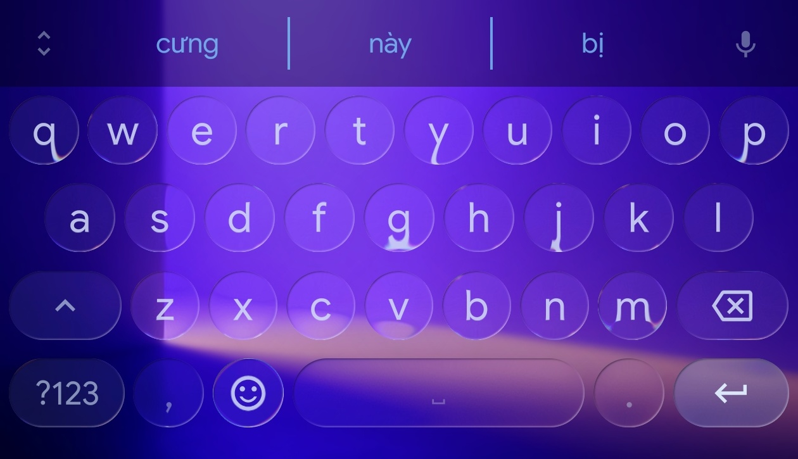

<p align="center">
  
</p>

<h1 align="center">ViKey</h1>

<p align="center">
  <strong>Vietnamese Telex Keyboard for Android</strong><br>
  IME mã nguồn mở đầu tiên dùng xử lý âm tiết thuần thuật toán —<br>
  không lookup table, không mutation, không dictionary dependency.
</p>

<p align="center">
  
  
  
  
</p>

---

## Tại Sao Lại Có ViKey?

Mọi IME mã nguồn mở trên Android đều xử lý Tiếng Việt theo kiểu **"có thì tốt, không có cũng được"**:

| IME | Engine Telex | Gỡ dấu real-time | Auto-correct VN | English detect | Gợi ý AI |
|-----|-------------|-------------------|-----------------|----------------|----------|
| **ViKey** | Thuật toán âm tiết | ✅ | ✅ (Levenshtein + QWERTY) | ✅ (3 lớp heuristic) | ✅ Qwen GGUF |
| FlorisBoard | Mutation table | ❌ | ❌ | ❌ | ❌ |
| Heliboard | Mutation table | ❌ | ❌ | ❌ | ❌ |
| FUTO Keyboard | Mutation table | ❌ | ❌ | ❌ | ❌ |
| OpenBoard | Mutation table | ❌ | ❌ | ❌ | ❌ |

**Mutation table** là cách mà tất cả các IME khác dùng: tra bảng `"ao" → "ào"`, `"oo" → "ô"`. Cách này có vấn đề:

- **Drift state** — gõ nhanh dễ bị lệch, ra kết quả sai
- **Không đọc được dấu đang gõ** — gợi ý từ không cập nhật theo dấu thanh
- **Phải có entry cho mọi tổ hợp** — không xử lý được tri giác (vd: `uow` → `ươ`)
- **Không phân biệt được Tiếng Việt / Tiếng Anh** — gõ "school" dễ biến thành "schôôl"

ViKey giải quyết tất cả bằng **một engine xử lý âm tiết thuần thuật toán** — parse cấu trúc ngữ âm, không lookup table.

---

## Engine Telex Khác Biệt Như Thế Nào?

Những IME khác gõ Telex kiểu:

```
gõ "chaof" → tra bảng thấy "ao" → "ào" → ghép → "chào" ❌
              (nếu state sai sẽ ra "chaof" hoặc "chàoo")
```

ViKey gõ Telex kiểu:

```
gõ "chaof" → parseSyllable("chao") → onset:"ch" + nucleus:"ao"
           → applyTone('f') → "ào" → ghép → "chào" ✅
              (mỗi lần gõ là parse lại từ đầu, không drift)
```

**Hệ quả thực tế:**

| Tình huống | IME khác | ViKey |
|------------|----------|-------|
| Gõ `"bá"` rồi sửa thành `"bà"` | Gợi ý không đổi hoặc sai | Gợi ý lập tức chuyển → `bàn — bàng — bài` |
| Gõ `"uow"` → `"ươ"` | Không hỗ trợ | ✅ Phím tắt 3 ký tự |
| Gõ `"z"` cuối từ để xoá dấu | Không hỗ trợ | ✅ `"chàoz"` → `"chao"` |
| Gõ Tiếng Anh "school" | Biến thành "schôôl" | ✅ Tự nhận diện, không biến đổi |
| Gõ `"w"` đầu từ | Ra `"w"` hoặc lỗi | ✅ Ra `"ư"` nếu là âm tiết Việt |

---

## Tính Năng Nổi Bật

### 🤖 Gợi Ý Thông Minh (AI + Personal)

ViKey hội tụ **3 tầng** gợi ý từ:

1. **Từ điển tĩnh** — 77k từ Tiếng Việt có tần suất thực tế (OpenSubtitles 2018)
2. **Personal dictionary** — tự động học từ bạn hay gõ, có **decay theo thời gian** (từ lâu không dùng tự tụt hạng) + **damping** (bạn không chọn, nó không học lại)
3. **Qwen GGUF LLM** *(bản Full, optional)* — import model ngôn ngữ, suggest từ tiếp theo theo context thực tế

**Autocorrect** thông minh: kết hợp Levenshtein distance + keyboard proximity (QWERTY) + Qwen score + length ratio — composite scoring 4 thành phần.

**TypoDetector** chuyên biệt cho người Việt: phát hiện thiếu dấu thanh, swap phím bên cạnh, gõ thừa ký tự, thiếu modifier (a→aa/aw), sai tone key.

### 🎨 Giao Diện & Themes

| Giao diện | Mô tả |
|-----------|-------|
| **Liquid Glass** 🪟 | Hiệu ứng kính mờ real-time với lens animation, chromatic aberration, ripple wave, depth effect. **Không IME mã nguồn mở nào có.** |
| **Sakura / Valentine** | 12 theme tùy chỉnh theo mùa |
| **Material You** | Dynamic color theo hệ thống |
| **20+ themes** | Cài thêm qua extension store |

<p align="center">
  
  
  
</p>

### 🧠 Tự Nhận Diện Tiếng Anh

Không cần chuyển chế độ thủ công. 3 lớp heuristic:

1. **Pattern matching** — `tion`, `ness`, `ship`, `ight`...
2. **Kiểm tra âm cuối** — chỉ `c/m/n/p/t/ch/ng/nh/ngh` là âm cuối hợp lệ trong Tiếng Việt
3. **Mật độ nguyên âm** — chuỗi phụ âm > 3 ký tự → Tiếng Anh

Tỉ lệ dương tính giả cực thấp nhờ kết hợp cả 3 lớp.

### ⌨️ Phím Tắt Telex Thông Minh

| Tổ hợp | Kết quả | Ghi chú |
|--------|---------|---------|
| `uow` | `ươ` | Phím tắt 3 ký tự — không IME nào có |
| `aw` / `aa` / `ee` / `oo` / `ow` / `uw` / `dd` | ă / â / ê / ô / ơ / ư / đ | 7 phím tắt chuẩn |
| `ưw` → `uw` | Undo phím tắt | Gõ lại lần hai để undo |
| `z` cuối từ | Xoá toàn bộ dấu | `"chàoz"` → `"chao"` |
| `w` đầu/sau phụ âm | `ư` / `Ư` | `"kw"` → `"kư"` |
| `w` sau nguyên âm | `w` thường | `"baw"` → `"băw"`? Không, `"baw"` → `"bă"` |

### 📋 Kế Thừa Toàn Bộ Tính Năng Từ FlorisBoard

- Glide typing vẽ đường trượt
- Clipboard manager (lịch sử, pin, auto-clean)
- Emoji palette + search + skin tone
- One-handed mode, floating keyboard
- Spell checker (Android API)
- Inline autofill (API 30+)
- Extension system (themes, layouts)
- Multi-window, resize mode
- Incognito mode

---

## Quyền Riêng Tư

**Zero network access. Zero tracking. Zero analytics.**

```
┌─────────────────────────────────────────────┐
│  Mọi thao tác gõ phím → ở lại trên máy bạn  │
│  Không Internet → không gửi dữ liệu đi đâu   │
│  Telex engine local 100% → không API call    │
│  Qwen model chạy native (JNI) → offline      │
└─────────────────────────────────────────────┘
```

ViKey theo triết lý **privacy-first** của FlorisBoard. Mọi thứ từ gợi ý, autocorrect, đến AI đều chạy **trên thiết bị**, không cần Internet.

---

## Download

| Phiên bản | Mô tả |
|-----------|-------|
| **Full** | Bao gồm Qwen JNI .so. Import GGUF model để có gợi ý AI. |
| **Lite** | Gọn nhẹ, không model. Frequency-based suggestions. |

Tải về từ [Releases](https://github.com/ngocthanhgl/ViKey-Telex/releases).

---

## Giấy Phép

Apache 2.0. Xem [LICENSE](LICENSE).

Bản quyền gốc © 2020-2026 The FlorisBoard Contributors.  
ViKey Telex engine © 2026 Nguyễn Ngọc Thành.
