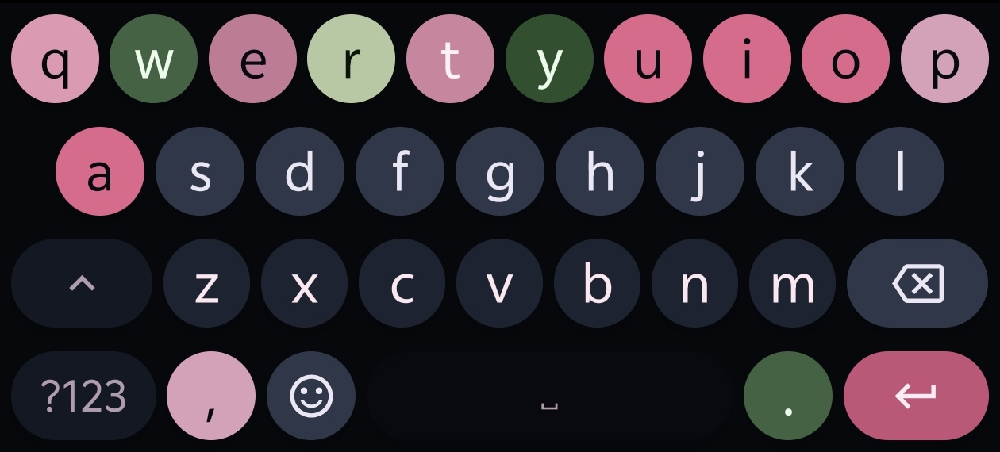
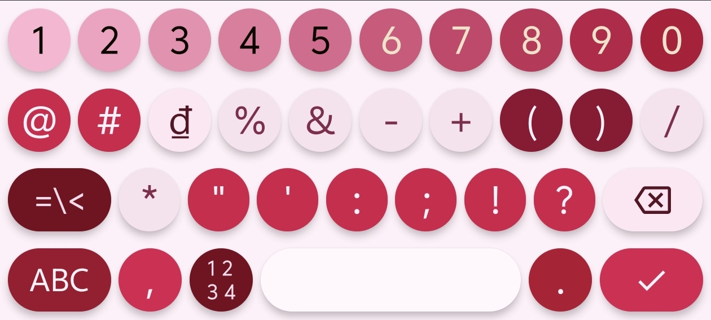

<p align="center">
  
</p>

<p align="center">
  
  
  
</p>

## Why ViKey?

FlorisBoard's built-in Telex uses hardcoded JSON replacement rules — a string-matching table that can't extrapolate. Every valid Vietnamese combination must be hand-written in the table. Miss one, and typing breaks.

ViKey replaces that entirely with a **syllable-based recomposition engine** written in pure Kotlin. No JSON. No lookup tables. No word lists. Just algorithmic Vietnamese phonology.

```kotlin
// FlorisBoard: "chaos" → "chào" ( "ào" must be in table)
// ViKey: parse("chao") + applyTone('f') → "chào" (algorithmic)
```

---

## Features

| | ViKey Telex | FlorisBoard Telex |
|---|---|---|
| **Engine** | Syllable-based recomposition | JSON replacement rules |
| **Vocabulary** | Infinite (algorithmic) | Table-bound (only coded patterns) |
| **Tone placement** | Orthographic Quốc Ngữ rules | Priority-heuristic patch |
| **Diphthongs** | Full: `ai,ay,au,ao,oi,ôi,ơi,ui,ưi,eo,êu,iu,ưu,ây` | Partial |
| **`z` undo** | Strips tones, returns to base form | Not supported |
| **`ww`→`w` undo** | Built-in lifecycle | Produces `ưw` |
| **English fallback** | Pattern + consonant cluster + vowel density | Not supported |
| **Case preservation** | Shortcuts, tones, standalone `ư` | Partial |
| **`gi`/`qu` handlin** | Syllable-aware (`gi`=onset `g`+nucleus `i`) | Table-dependent |
| **Recomposition** | Full re-parse every keystroke — no drift | N/A |

---

## Theme

| Dark | Light |
|:---:|:---:|
|  |  |
|:---:|:---:|
| Dark | Light |

...and 12+ more custom themes built-in.

---

## How It Works

Every keystroke triggers a full parse → apply → rebuild cycle:

```
Keypress → Decompose → Parse Syllable → Apply Rules → Rebuild → Output
                ↑                                            ↓
          precedingText                              (deleteCount, replacement)
```

No state is carried between keystrokes except the composed text itself. This eliminates the accumulated drift that plagues mutation-based engines.

### Syllable Parser

Decomposes any Vietnamese string into standard linguistic components:

```
  n g u y ễ n
  ↑↑   ↑↑  ↑
onset nucleus coda + tone
```

Handles all Vietnamese onset clusters: `ngh`, `ng`, `ch`, `gh`, `gi`, `kh`, `nh`, `ph`, `th`, `tr`, `qu`.

### Tone Position

Determined by the modern Vietnamese orthographic standard (1984 Quốc Ngữ rules):

1. **Diphthong/triphthong rules**: `oa→a`, `oe→e`, `uy→y`, `iê→ê`, `yê→ê`, `uô→ô`, `ươ→ơ`, etc.
2. **Priority fallback**: `ê/ơ` → `â/ă/ô` → last vowel
3. **`gi` / `qu` exceptions**: tone goes to the real vowel, not `i`/`u`

### English Fallback Detection

Uses three complementary heuristics to avoid mangling English words:

- **English patterns**: `tion`, `ness`, `ship`, `str`, `ight`, `ould`, ...
- **Coda validation**: checks whether suffix is a valid Vietnamese coda (`c`, `m`, `n`, `p`, `t`, `ch`, `ng`, `nh` only)
- **Vowel density**: words with 0 vowels or runs of 3+ consonants not in Vietnamese phonology are flagged English

---

## Technical Highlights

- **Zero dictionary dependency** — no word list, no ML, no network
- **No JSON tables** — 100% algorithmic, full of Kotlin
- **Property-based fuzz tested** — 18,000+ randomly generated invariants verified
- **42 unit tests** covering tone placement, shortcuts, English fallback, casing, undo lifecycle
- **Compatible with all FlorisBoard features**: layouts, themes, glide typing, clipboard, emoji, spell check, extension

---

## Privacy

ViKey follow FlorisBoard's privacy-first design: **no network access, no tracking, no analytics**. Every keystroke stays on your device.

---

## License

Apache 2.0. See [LICENSE](LICENSE).

Original copyright © 2020-2026 The FlorisBoard Contributors.  
Algorithmic Telex engine © 2026 NgocThanhGL.
