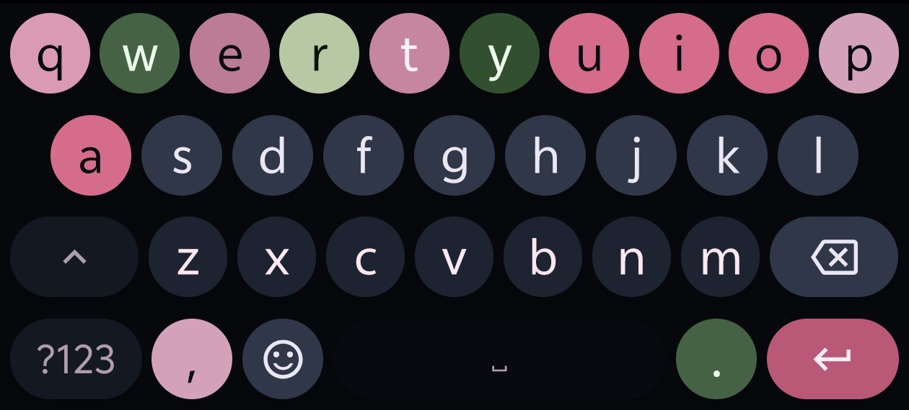
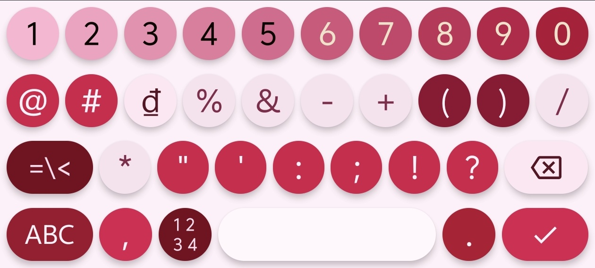
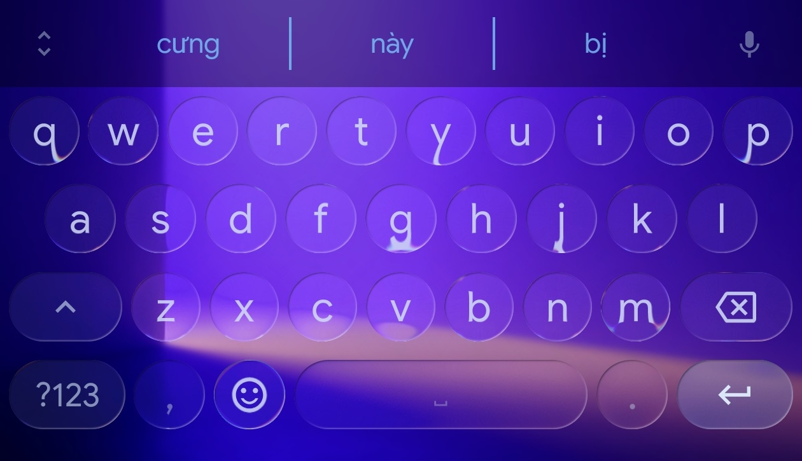

<table align="center" width="100%">
  <tr>
    <td width="140" valign="middle">
      
    </td>
    <td valign="middle">
      <h1>ViKey</h1>
      <p><strong>Bàn phím Telex Tiếng Việt cho Android</strong></p>
      <p>
        Engine telex thuần thuật toán, <strong>độc lập thứ tự phím</strong> —<br>
        gõ sai thứ tự vẫn ra đúng một kết quả.
      </p>
      <p>
        
        
        
      </p>
    </td>
  </tr>
</table>

---

## Tính Năng

### ⌨️ Telex Tự Do — Độc Lập Thứ Tự Phím

Engine parse cấu trúc âm tiết thay vì tra bảng mutation. Kết quả không phụ thuộc thứ tự bạn gõ:

```
tuaws = tuwas = tuaw s = tuw as  →  tựa
duongwf → đường          nguoifw → người
```

| Tổ hợp | Kết quả |
| --- | --- |
| `aw` / `aa` / `ee` / `oo` / `ow` / `uw` / `dd` | ă / â / ê / ô / ơ / ư / đ |
| `uow` | ươ |
| Gõ lại phím tắt lần hai | Undo (`ưw` → `uw`) |
| `z` cuối từ | Xoá toàn bộ dấu (`chàoz` → `chao`) |
| `w` đầu từ / sau phụ âm | ư nếu là âm tiết Việt |

### 💡 Gợi Ý Thông Minh

- Từ điển ~33.000 từ Tiếng Việt kèm tần suất thực tế + từ điển Tiếng Anh
- **Gõ không dấu ra có dấu** — `duoc` gợi ý ngay `được`
- **Học từ cá nhân** — từ bạn hay gõ được ưu tiên dần
- **Xếp hạng theo ngữ cảnh** — bigram của câu đang gõ quyết định thứ tự gợi ý
- Không học gì ở chế độ ẩn danh

### 🌐 Song Ngữ Không Cần Chuyển Chế Độ

Tự nhận diện Tiếng Anh theo pattern, âm cuối và mật độ phụ âm — gõ `school` không bị biến thành tiếng Việt.

### 🔠 Viết Hoa Tự Động

Tự viết hoa đầu câu, sau dấu chấm — hoạt động cả trong những app không khai báo hỗ trợ (kiểu Gboard).

### ❓ Dấu Câu Thông Minh

- `word` + `,` → `word,` (không bị thành `word ,`)
- Double-space → `word. `

### 👆 Glide Typing

Gõ trượt ngón tay qua các phím. Tùy chọn trong cài đặt (mặc định tắt).

---

## 🎨 Liquid Glass

Hiệu ứng kính mờ real-time — nền wallpaper hoặc gradient tùy chọn, mặt kính trên từng phím bẻ cong phản chiếu nền thật, ánh sáng trượt khi nhấn, ripple wave, depth & chromatic aberration. Kèm thanh chỉnh độ mờ, độ sáng ảnh nền.

<table align="center">
  <tr>
    <td align="center"><br><em>Sakura Dark</em></td>
    <td align="center"><br><em>Valentine Light</em></td>
    <td align="center"><br><em>Liquid Glass</em></td>
  </tr>
</table>

Ngoài ra: Material You dynamic color, emoji palette đầy đủ, one-handed mode, clipboard.

## Quyền Riêng Tư

**Zero network access. Zero tracking. Zero analytics.**

```
╭──────────────────────────────────────────────╮
│  Mọi thao tác gõ phím → ở lại trên máy bạn   │
│  Không Internet → không gửi dữ liệu đi đâu   │
│  Engine + từ điển local 100%                 │
╰──────────────────────────────────────────────╯
```

## Download

Tải về từ [Releases](https://github.com/ngocthanhgl/ViKey-Telex/releases). Mỗi tag release đều có APK build tự động.

## Cảm Ơn

Dự án có sử dụng AI coding hỗ trợ xuyên suốt quá trình phát triển: **DeepSeek V4 Flash** giai đoạn đầu và **Ox Alpha** giai đoạn sau.

## Giấy Phép

Apache 2.0. Xem [LICENSE](LICENSE).

Bản quyền gốc © 2020-2026 The FlorisBoard Contributors.  
ViKey Telex engine © 2026 Nguyễn Ngọc Thành.
